# How a SWORD deposit becomes a submission

SUBMISSION-29. How the SWORD deposit API turns a depositor's uploaded files into a
submission that the Flask submit UI lists, and where that pipeline currently stops.

Companion documents, under [`docs/prs/submission-29-sword-api/`](prs/submission-29-sword-api/):
[implementation plan](prs/submission-29-sword-api/20260730-plan.md),
[code review](prs/submission-29-sword-api/20260804-code-review.md),
[security review](prs/submission-29-sword-api/20260804-security-review.md),
[design review](prs/submission-29-sword-api/20260810-design-review.md).
Also the [manual testing guide](sword-getting-started.md).

## The short version

SWORD is a **two-step** protocol. Files and metadata arrive in separate requests,
and it is the *second* one that creates anything in the database.

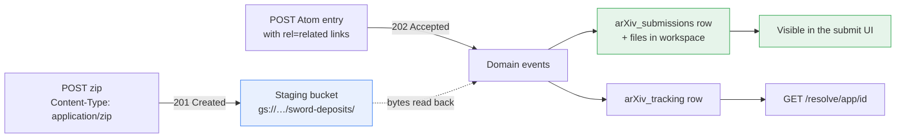

A media deposit stages bytes and returns an id. Nothing is in the database yet. The
wrapper deposit names those ids, and *that* is when a submission is created — in a
single transaction, as the same domain events an interactive submission produces.

## Step 1 — media deposit

`POST /sword-app/{collection}-collection` with a file body.

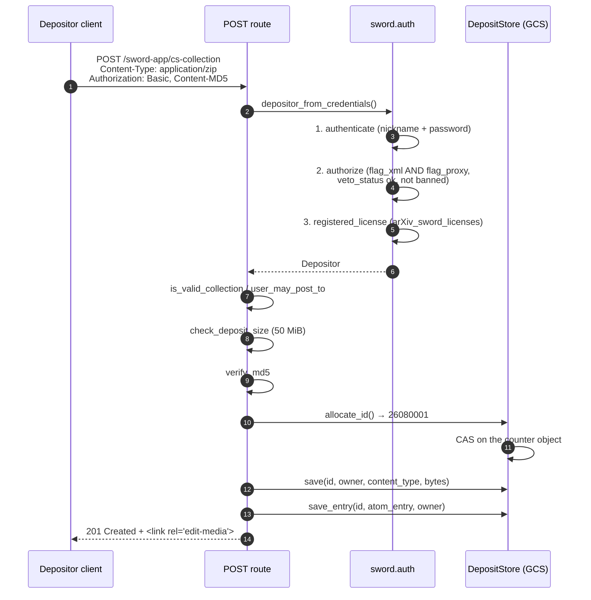

The bytes land in a **staging** area keyed by deposit id, not in any submission:

```
<prefix>/nextid                    the allocation counter
<prefix>/<yymm>/<id>.<ext>         the deposited bytes
<prefix>/<yymm>/<id>.atom          the response entry
```

A depositor repeats this per file. The manual recommends bundling TeX sources as
one zip, and depositing large figures separately
([`arxiv-docs/source/help/submit_sword.md:317`](https://github.com/arXiv/arxiv-docs/tree/develop/source/help/submit_sword.md#L317)).

## Step 2 — wrapper deposit, which creates the submission

Same URL, `Content-Type: application/atom+xml;type=entry`. The body carries the
metadata plus `rel="related"` links naming the deposits from step 1.

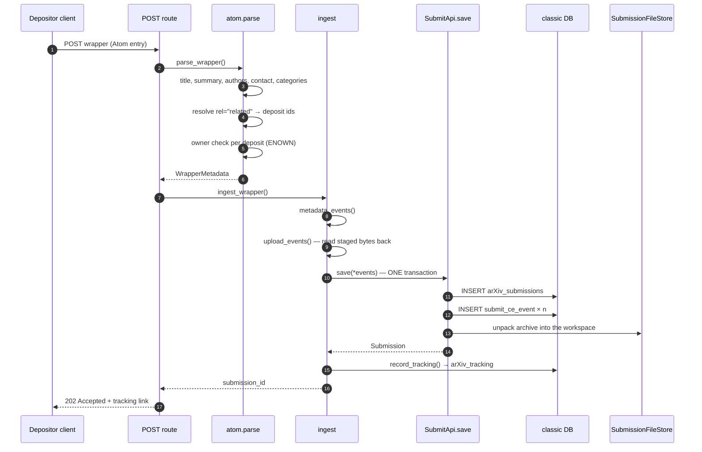

### The event sequence

[`submit_ce/sword/ingest.py`](https://github.com/arXiv/submit-ce/tree/develop/submit_ce/sword/ingest.py)'s `metadata_events` and `upload_events` build exactly the stream an
interactive submission produces — which is the point of doing this inside submit-ce
rather than beside it:

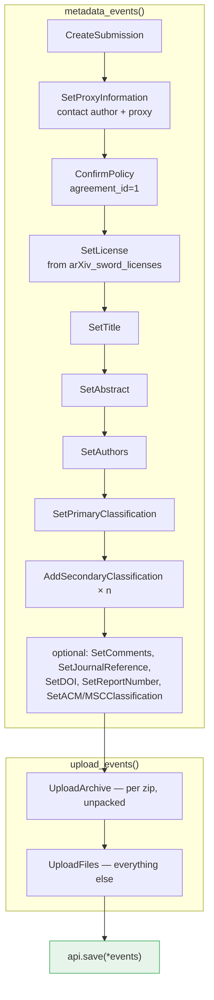

Everything goes through a **single** `SubmitApi.save`, so a validation failure
anywhere leaves no partial submission.

### Where the files actually move

This is the transition the question is really about. `upload_events` reads each
staged deposit back out of the SWORD bucket and re-wraps it in the shape the upload
events expect:

```python
staged = StagedFile(filename=f"{deposit_id}.{deposit.extension}",
                    content_type=deposit.content_type,
                    stream=io.BytesIO(data))
if deposit.extension == "zip":
    events.append(UploadArchive(creator=creator, client=client, file=staged))
else:
    loose.append(staged)
```

Applying the event copies the bytes into the *submission's* workspace in
`SubmissionFileStore`. A zip goes through `UploadArchive` so it is unpacked;
anything else is added as a loose file. The staging copy is left where it is and
ages out under a bucket lifecycle rule ([`arxiv-docs/source/help/submit_sword.md:744`](https://github.com/arXiv/arxiv-docs/tree/develop/source/help/submit_sword.md#L744)).

## What makes it appear in the submit UI

Two fields, both set during step 2.

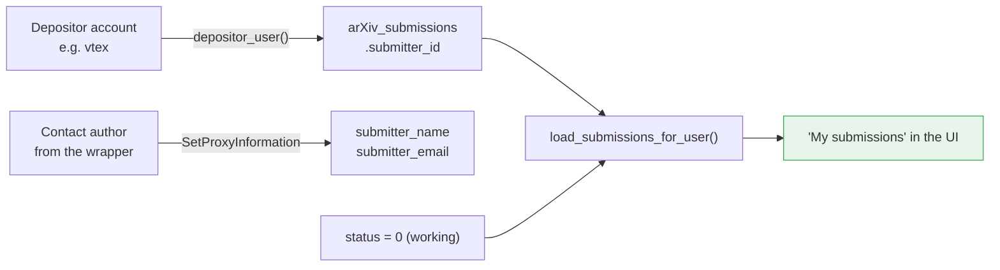

The UI's list query is:

```python
select(models.Submission).where(
    models.Submission.submitter_id == int(user_id),
    models.Submission.status.in_([0, 1, 2, 4]))
```

Two consequences worth being explicit about:

- **The submission belongs to the depositing account, not the author.** A proxy
  depositor like `vtex` sees it in *their* list. The author reaches it through
  `SetProxyInformation`, which fills `submitter_name` / `submitter_email`.
- **A fresh deposit is status 0 (working)**, which is in that list, so it appears
  immediately and is editable through the normal workflow.

## Step 3 — the worker finishes it

[`submit_ce/sword/ingest.py`](https://github.com/arXiv/submit-ce/tree/develop/submit_ce/sword/ingest.py) deliberately stops short:

> Compilation and `FinalizeSubmission` are **not** done here. `FinalizeSubmission`
> requires `source_format`, which only preflight can determine, so finalizing is
> left to the async compile path.

That path is [`submit_ce/sword/worker.py`](https://github.com/arXiv/submit-ce/tree/develop/submit_ce/sword/worker.py), driven by
[`submit_ce/sword/worker_loop.py`](https://github.com/arXiv/submit-ce/tree/develop/submit_ce/sword/worker_loop.py). It cannot ride on the deposit
request: preflight and compile are blocking calls with an 840-second timeout
each, and both run inside `SubmitApi.save`, which holds `SELECT … FOR UPDATE` on
the submission row throughout. Close to half an hour with the row locked, against
a 202 that promises asynchronous ingestion.

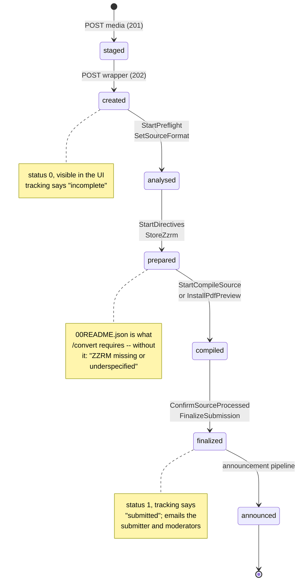

Every step is guarded on state that survives a restart — a file in the store, or a
field on the submission — so a worker killed mid-compile resumes rather than
redoing work. Three of the steps call tex2pdf: `/preflight`, `/directives` and
`/convert`.

**It refuses to finalize a submission with no preview.** Nothing in the domain
stops `FinalizeSubmission` queueing a paper whose compile produced no PDF;
interactively the Submit button is gated on the preview, and a worker has no such
gate. A permanent failure is recorded in `arXiv_tracking.submission_errors` — the
column legacy used for the same purpose — which both takes the submission out of
the queue and shows the depositor why through `/resolve`.

Retryable failures are treated differently: a 5xx from tex2pdf, or a 401/403 from
expired credentials, says nothing about the deposit, so it is left alone and picked
up next pass.

Run it with [`local_sword_worker.py`](https://github.com/arXiv/submit-ce/tree/develop/local_sword_worker.py); it deploys as a Cloud Run
**Job** ([`cicd/cloudbuild-sword-worker-dev-arxiv.yaml`](https://github.com/arXiv/submit-ce/tree/develop/cicd/cloudbuild-sword-worker-dev-arxiv.yaml)), one pass per
execution. One worker at a time is the supported deployment: `SKIP LOCKED` stops a
second worker blocking on a compile, but it is not a lease.

## Tracking — what the depositor can poll

`GET /resolve/app/{sword_id}` is unauthenticated (matching legacy — `sword.conf`
gated `/sword-app` but not `/resolve`) and reads `arXiv_tracking`, whose `paper_id`
column is overloaded as a state field.

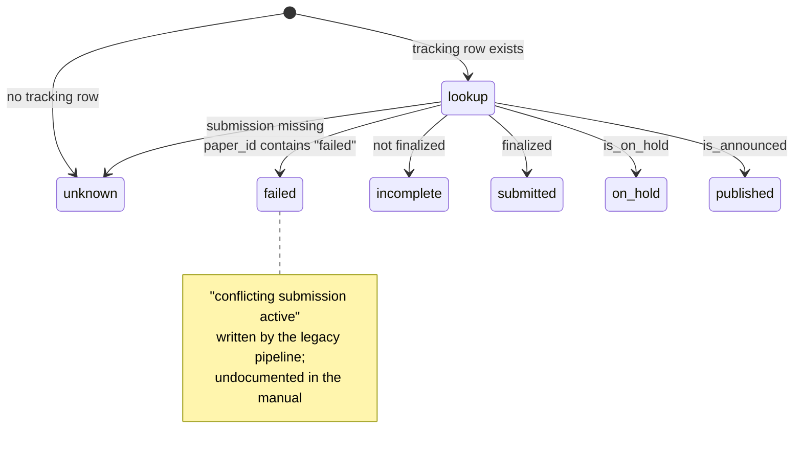

Precedence in `tracking._status_for` is announced → on hold → finalized →
incomplete. A held submission is still finalized in submit-ce's model, so the hold
has to win.

## The classic tables involved

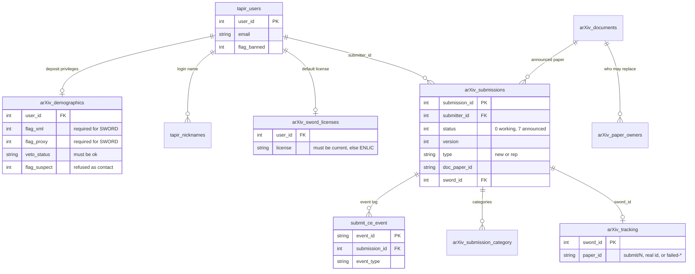

Note `arXiv_submissions.sword_id` is a foreign key onto `arXiv_tracking.sword_id`,
so `record_tracking` has to insert the tracking row *before* back-linking it.

## The staging store

The deposit store is separate from the submission file store, with its own
interface and two implementations.

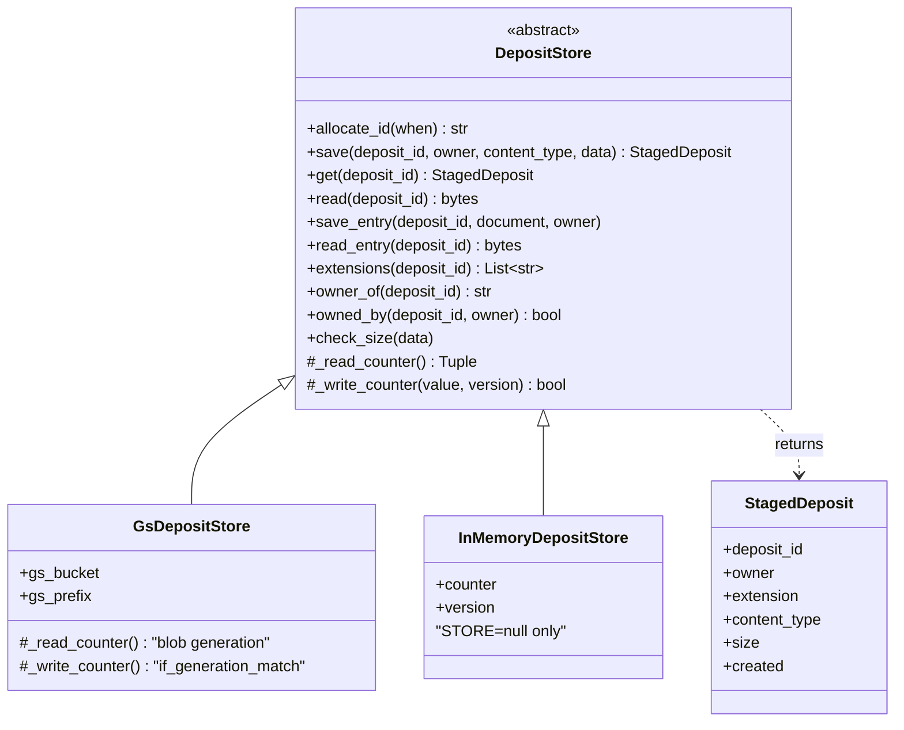

`allocate_id` lives on the base class and is written in terms of the two counter
primitives, so both backends share the retry loop. On GCS the CAS is
`if_generation_match`, replacing the `flock` legacy used (`AtomPP.pm:586-596`);
generation `0` means "only if absent", which is how the counter is created.

`build_deposit_store` is exhaustive on `STORE` and raises on an unrecognized value —
falling through to memory would return 201 for deposits whose bytes live only in one
process's heap.

## Request dispatch

One route serves both deposit kinds; the content type decides.

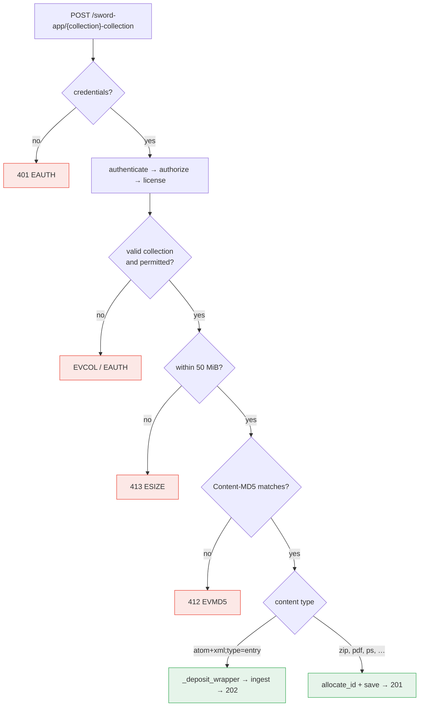

Check order follows `AtomPP.pm:218-343`: credentials, collection, permission, SWORD
headers, checksum, then id allocation. Size is checked before the checksum so an
oversize body is not hashed first, and before the dispatch so a wrapper is capped
too — legacy's `$CGI::POST_MAX` applied to the whole request regardless of type.

## Replacement

A replacement is a new **version** of an announced paper, not a new submission.

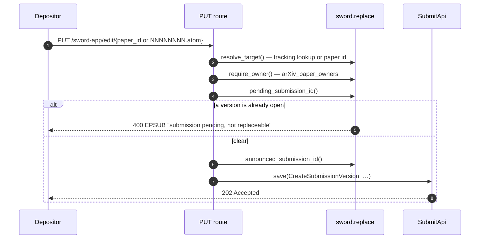

### Three ids, three jobs

A replacement is where classic's one-row-per-version model and the domain's
one-submission model pull apart, and each of the three answers a different
question:

| | keyed by | why |
|---|---|---|
| **Identity** — workspace, event log, URL | the paper's *original* row | one submission, one history, whatever classic does underneath |
| **State** — version, status | the *newest* `new`/`rep` row | "what does this paper look like now" |
| **Discovery** — `sword_id` | the row *this deposit* created | legacy stamped the row it made (`Submission.pm:319-332`); it is how the worker finds work |

`_load` reconciles the first two: it projects the newest row while reporting the
id it was asked for, which is what `to_submission`'s `submission_id` override is
for. The worker reconciles the third, finding candidates by classic row and then
driving the paper by its origin — the files it needs to compile live under the
identity, not under the row that announced the version.

Getting any one of these wrong is quiet rather than loud. Filing events under the
version row split one paper's history in two; reading the requested row instead of
the newest reported a replaced paper as still at v1, so `CreateSubmissionVersion`
recomputed a version that already existed; and omitting the `sword_id` left the
replacement invisible to the worker, so it was never compiled.

## Design intent, in one line

A SWORD deposit produces *exactly* the event stream an interactive submission does.
That is what lets the same UI, workflow, and moderation tooling handle both without
knowing where a submission came from — and it is the reason this was built inside
submit-ce rather than as a separate service.
